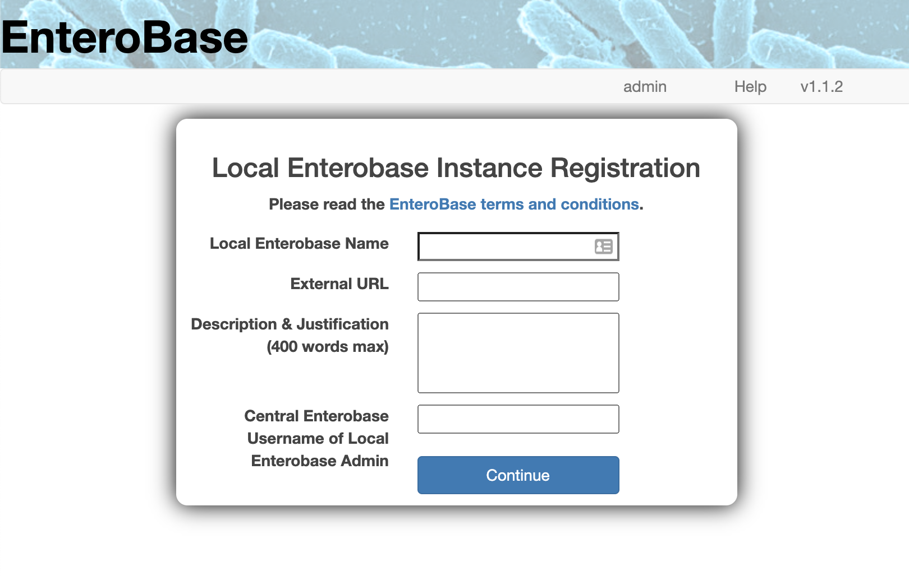

Registration
---------------

In order to maintain quality control in the distributions of EnteroBase to partner institutions, each Local EnteroBase instance must be approved by Central EnteroBase at Warwick (Warwick EnteroBase). This approval process begins with registering your Local EnteroBase instance. Once you have performed this registration, you will receive a test token which you need to save for later use (NOTE: this is used during the configuration once you are able to run assemblies, so please keep it safe). This token is used to test your Local Enterobase instance and feeds back the results to Central Enterobase before your instance is approved. The Warwick Enterobase team will review your request once the test results have been received. If at any point you forget where you saved your test token, you can find it at: https://35.246.24.128:5566/local_enterobase/display_test_token. If this link returns an error, it either means you haven't submitted a Local EnteroBase request or your Local EnteroBase request has already been approved.

Prerequisites
==============

* You must have an account with the beta version of Central EnteroBase, and be logged in.
* You must know the URL or IP endpoint that your Local EnteroBase will be exposed to.

Registration Page
==================

Once the prerequisites have been completed you can now fill out the form at: https://35.246.24.128:5566/local_enterobase/register.

   **Fig. 2 - Local EnteroBase Registration Form**

The above image is a screenshot of the Local EnteroBase registration page (NOTE: you must be logged in to view it). All fields within the form are required and can be described as follows:

1. **Local EnteroBase Name**: The name you would like your Local EnteroBase instance to be referred to as, for example: "Warick Beta Test EnteroBase".
2. **External URL**: The URL or IP address that a user can connect to your Local Enterobase with (NOTE: you must have ownership of this URL), for example: "https://enterobase.warwick.ac.uk".
3. **Description & Justification**: This is your opportunity to tell us why you would like to maintain your own Local EnteroBase instance. You may want to include details about the institution that will be using it, how it will be used, and anything else you would like the Warwick EnteroBase team to know.
4. **Central EnteroBase Username of Local EnteroBase Admin**: This field is just a double check to see if you want the currently logged in user to be the administrator (contact) of the Local Enterobase instance. If you input anything other than the currently logged in user's Central EnteroBase username, you will be informed that you need to be logged in as that user (NOTE: you can only be the administrator for one Local EnteroBase instance).
