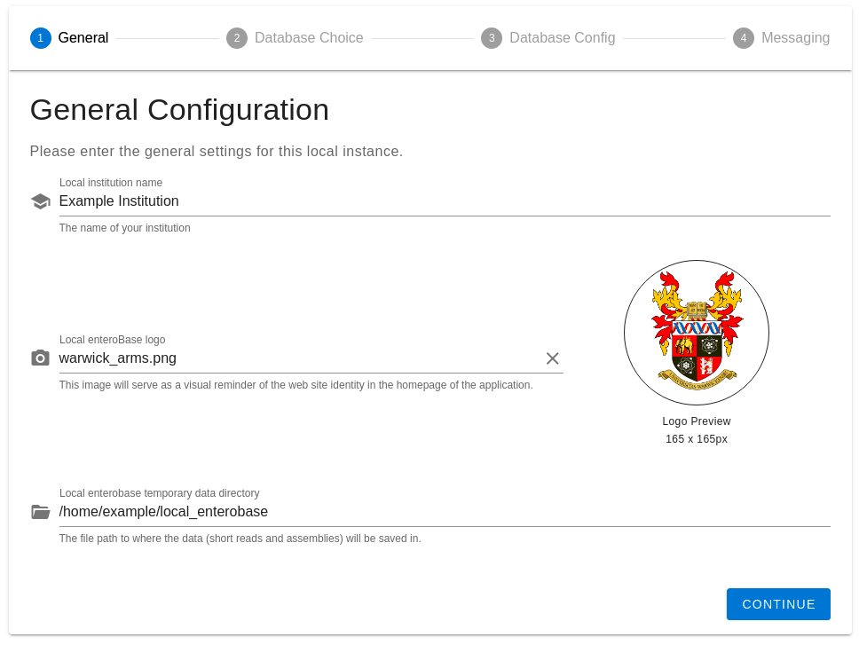
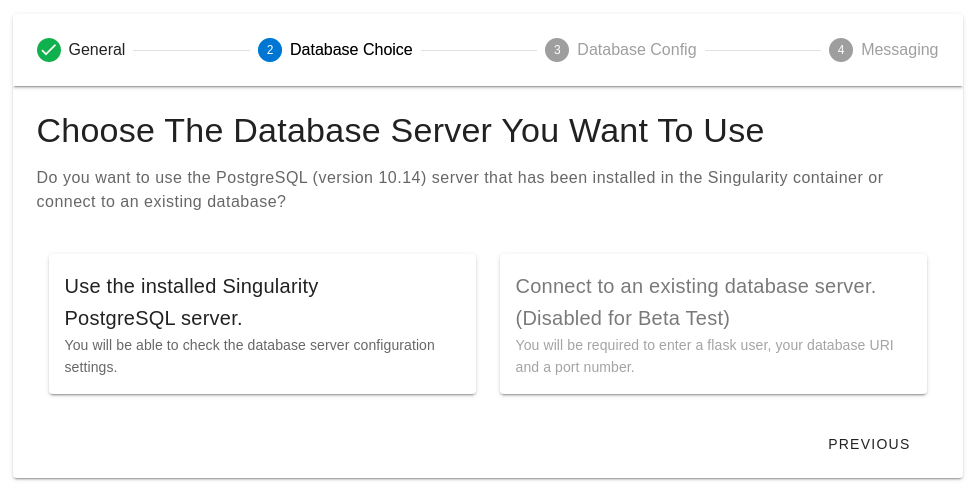
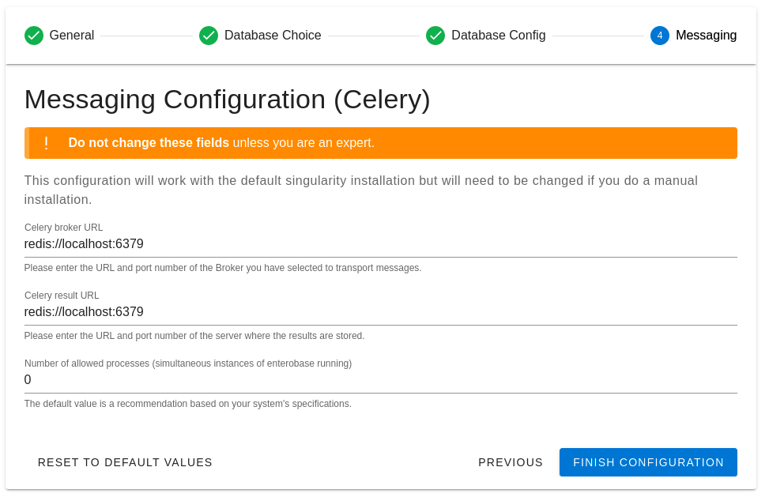

System Configuration
---------------------

On entry to the webpage, the Local EnteroBase administrator is required to sign in with the system credentials set during
the installation phase. After this, the following configuration steps which need to be completed will be displayed. They can be traversed using the
"continue" and "previous" buttons should you complete a configuration step or need to redo a step respectively.

General Configuration
=======================

* A name for your Local EnteroBase, to be displayed when using the website, must be inputted. It does not need to match the name used to register your Local EnteroBase.
* An image to be displayed as a logo in the homepage. We provide functionalities for transforming the original image to create a perfect logo if required.
* A filepath to an accessible directory that stores data produced by Local EnteroBase, such as short-read assembly results, can be selected. A default file path is automatically
  filled in on the form. The directory specified by the path must be manually created for security reasons.

   **Fig. 1 - General Configuration Form**

Database Selection and Configuration
=====================================

Note: To ensure that the default server is functional, selecting an existing database server to connect to as well as the option to modify the pre-filled current database server settings (set during installation) are disabled for the beta test.

* The database server to be used by your Local EnteroBase can be selected at this stage, between one that is set up during installation of the Singularity container or an existing database server if you have one.

  * We recommend using the PostgreSQL version 10.14 database server set up during installation of the Singularity container as we have used this to develop Local EnteroBase.
  * Additionally, we cannot guarantee that using an existing database server, especially a non-PostgreSQL version 10.14 server, maintains the expected functionality of Local EnteroBase.

* After selecting the database server, a form for either configuring the default settings for the preset database server or entering credentials for an existing server (a flask username, server URI and port number) will be displayed for you to fill out.

   **Fig. 2 - Database Choice Form**

Mail Server
===============

Note: **The mail server is unavailable for this beta test**. The Warwick EnteroBase team will manually
send emails as appropriate, particularly for registration and the test token to perform the upload test in the next configuration step. Feel free to skip this section.

Central EnteroBase would provide updates for significant events such as completed assemblies. Details must be inputted that configures a mail server to automatically receive email updates from Central EnteroBase: the domain, port, an account name and a password.
The form also provides options for advanced configuration such as using TLS and SSL email encryption protocols.

Celery Messaging
=================

The primary functionalities of Local EnteroBase, such as preparing and assembling short-read assembly files, are managed and accomplished as 'jobs' in the background using the Celery task scheduler and Celery worker processes.
A form is provided that is pre-filled with default values, which correctly configures the Celery functionalities with your Local EnteroBase. **Please do not modify these values unless you are an expert.**

   **Fig. 3 - Celery Messaging Configuration Form**
