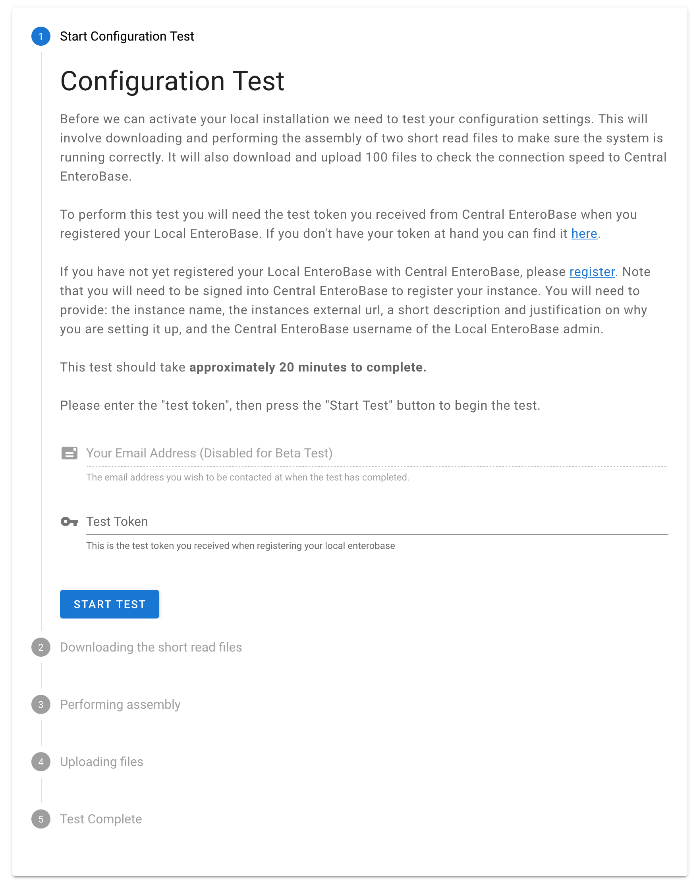
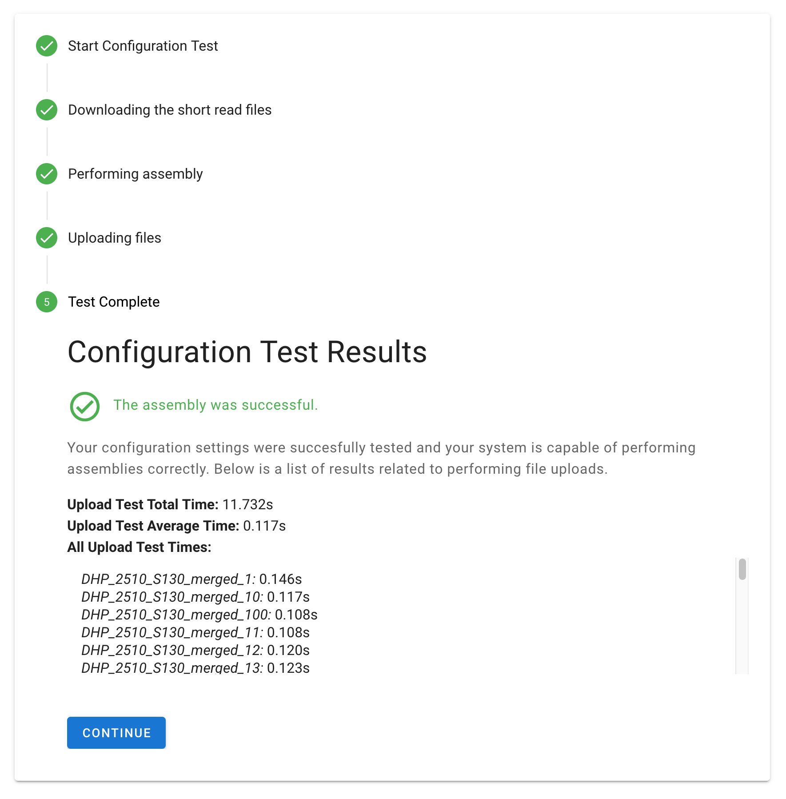

Upload Test
-----------------

The purpose of the upload test is to ensure that your Local EnteroBase has been correctly installed and configured.
The test consists of downloading and assembling 2 test short-read files and verifying their results. It will also
download and upload 100 files to check the connection speed to Central EnteroBase.

Prerequisites
==============

* Test token on hand, it was emailed by Central EnteroBase when registering your Local EnteroBase. You can also find it here: https://35.197.247.144:5566/local_enterobase/display_test_token
* Celery task scheduler and worker processes to be initialised. These are the background processes that will assemble the test short-read files and upload their results. They can be initialised using the Singularity container with the following commands:

  ::

    singularity run --app celery_beat $HOME/local_enterobase_home/local_enterobase/EGP.sif

  ::

    singularity run --app celery_worker $HOME/local_enterobase_home/local_enterobase/EGP.sif

  * If the Celery processes are running, please restart them before beginning the upload test.
  * Please modify the default path/name of the container if you have changed this during installation.

Running the Test
=================

   **Fig. 1 - Incomplete Upload Test Form**

* Enter your email (**disabled for the beta test**) and your test token. Click the "start test" button to begin the test, it will automatically complete to a successful or erroneous state. Each step of the test displays an estimated time to complete, although the actual times will also vary depending on your geographical location.

  * 100 test short-read files, intended for performing download and upload speed tests, are downloaded.
  * A pair of downloaded short-read files are prepared and assembled to be uploaded to Central EnteroBase to verify the correctness of these functionalities.
  * The resulting FASTQ file of the test assembly is uploaded to Central EnteroBase where it is matched with the stored known result, which verifies that the preparation and assembly functions are working correctly.
  * In the final step, the MD5 checksum is extracted from each of the earlier downloaded short-read files and reuploaded with their respective file to Central EnteroBase to check the upload speed. Central EnteroBase also verifies the checksum against the stored known checksum, which checks that the files are not changing during upload.

* If the test has successfully completed, a summary is displayed of the times taken to reupload each short-read file to Central EnteroBase, as well as the total and average times across all reuploads. Click the "continue" button to proceed to the final configuration step to acquire credentials to use Local EnteroBase.
* If the test fails at any step, this will be displayed with an appropriate error message and a "retry" button that will reattempt the upload test when clicked.

  **Fig. 2 - Completed Upload Test Form**
