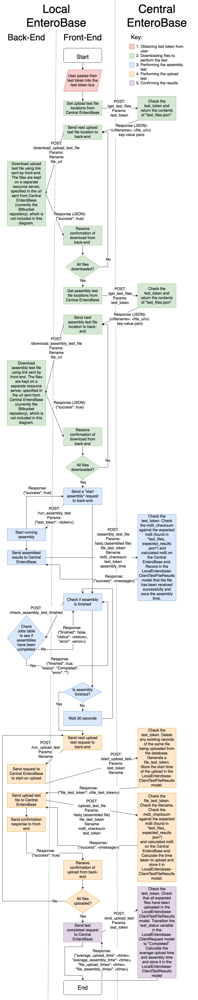

.. _configuration-test-label:

Configuration Test
------------------

The configuration test is used to verify that the Local EnteroBase installation is valid.
It is broken into 5 stages:

1. Start Configuration Test
2. Downloading Short Read Files
3. Performing Assembly
4. Uploading Files
5. Test Complete

Each stage is chained together in a link of asynchronous JavaScript calls. These use the async/await
feature from `ES6 <https://developer.mozilla.org/en-US/docs/Learn/JavaScript/Asynchronous/Async_await>`_.

Start Configuration Test
`````````````````````````

This stage gets the user to enter their test token and email address. This data is then
validated before proceeding to the next stage. The test_token is used throughout to validate
the local instance has been registered to Central EnteroBase and is allowed to be performing
the configuration test.

Downloading Short Read Files
``````````````````````````````

To avoid a timeout, the front-end makes a call to central_enterobase at the "/local_enterobase/get_test_files"
endpoint and then iterates through each upload file one by one in the js. Individual calls are then made to
the back-end for each file to download and save each file in "$HOME/local_enterobase/reads". This is done as 
the process will cause a timeout with NGINX otherwise as it takes longer than a minute to download 100 files.

The assembly test files are then downloaded after the upload test files have been downloaded successfully. Once 
these files are downloaded, it makes a call to the next stage to perform the assembly.

Performing Assembly
````````````````````

This stage works by making a call to "/run_assembly_test" to start an asynchronous call to the celery worker in the
back-end. This stage then polls "/check_assembly_test_finished" every 30s. This function makes a database call to see
if the status of the running job has changed or not. The front-end polls it until the variable "finished" in the response
is true. It then proceeds to the next stage and performs error handling in the case the assembly failed.

The polling is done to prevent a gateway timeout on nginx. Once this stage has finished it then goes onto the 
uploading files stage.

To verify the assembly is successful, the .fastq and .fasta files are sent to Central EnteroBase alongside the md5sum of the 
fastq file, and the test_token so Central EnteroBase can ensure its validity.

Uploading Files
````````````````

This stage calls the back-end at "/upload_test_file" to make asynchronous calls to the celery worker to upload all
100 files to central enterobase, one file per request. The files are uploaded to central along with their md5sum, and test_token so Central 
EnteroBase is able to verify the correct files are being sent and the local instance is allowed to be performing the 
upload test. 

This then makes a call to the final stage, Test Complete.

Test Complete
``````````````

This will display whether the test was successful or not and close up communication to Central EnteroBase.
If the test was valid it displays the upload time results, if it was erroneous it displays an error send_message
and gives the option to retry the configuration test.

Files and Functions
````````````````````

The back-end endpoints are located in:

- $PROJECT_ROOT/local_entero/configuration/views.py
    - config_test(): render template 
    - download_assembly_test_files(): download assembly test files
    - download_upload_test_files(): download upload test file
    - run_upload_test(): perform the upload test 
    - run_assembly_test(): start the assembly test
    - check_assembly_test_finished(): check assembly test finished
    - finish_upload_test(): end configuration test
- $PROJECT_ROOT/local_entero/configuration/utils.py
    - update_yaml_file(updates)
  
The front-end components are located in:

- $PROJECT_ROOT/local_entero/templates/configuration_test.html
- $PROJECT_ROOT/local_entero/static/js/configuration_test.js
    - checkFields()
    - startDownload()
    - startAssembly()
    - startUploads()
    - finishTest()

Full Configuration Test Communications
```````````````````````````````````````



   **Flowchart showing all communications involved in the configuration test**