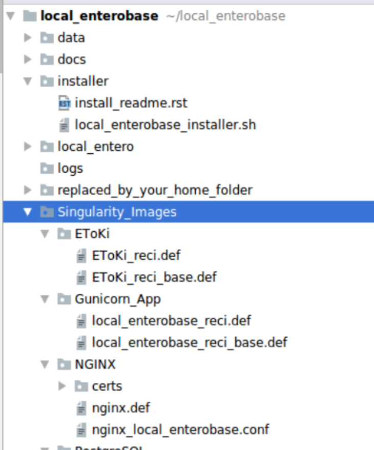

Developing Local EnteroBase
===========================

This section provides the documentation that we have produced to support developers working on Local EnteroBase.

The following figure illustrates the Local EnteroBase folder structure, all the images definition files are saved in the Singularity_Images sub-folder

   **Local EnteroBase folder structure**

.. toctree::
   :maxdepth: 2

   nginx
   egp
   pipeline
   testing
