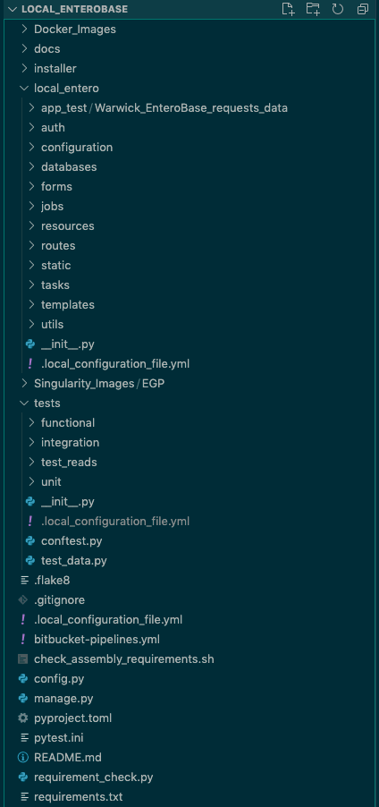

Developing Local EnteroBase
===========================

This section provides documentation to support future developers of Local EnteroBase.

**Fig. 1 - Local EnteroBase Directory Structure**

Directory Structure Descriptions
--------------------------------

- **Docker_Images** - stores the Docker container and related files such as certs, configuration etc.
- **docs** - where the development documentation is found.
- **installer** - where the automatic installation script and information is found.
- **local_entero** - the Local EnteroBase flask application code and files.
   - **app_test** - stores JSON Warwick EnteroBase request files (in the child directory **Warwick_EnteroBase_requests_data**).
   - **auth** - contains the authorisation routes and utility methods.
   - **configuration** - contains the configuration routes and utility methods.
   - **Databases** - contains the database models and utility methods.
   - **forms** - contains form related methods, such as validation checks for the configuration steps.
   - **jobs** - contains the job routes and utility methods.
   - **resources** - contains resources such as a list of countries and continents.
   - **routes** - contains the application routes and utility methods.
   - **static** - contains all the static files (files that aren’t server-generated, but must be sent to the browser when requested) such as JavaScript, images etc.
   - **tasks** - contains all the celery tasks for performing assemblies.
   - **templates** - stores the HTML template files.
   - **utils** - contains various utility methods.
   - ``__init__.py`` - the main function for the flask app, containing the initialisation code and builds the routes.
- **Singularity_Images** - stores the parent and child recipe files (in the child directory **EGP**) for the unified EToKi, Gunicorn and PostgreSQL container.
- **tests**
   - **functional** - contains the functional tests that have been written.
   - **integration** - contains the integration tests that have been written.
   - **test_reads** - contains the short read files for testing the assembly functions.
   - **unit** - contains the unit tests that have been written.
   - ``conftest.py`` - contains the test setup and teardown code.
   - ``test_data.py`` - contains test data to populate the database with.
- ``.gitignore`` -  the files/folders that git will ignore in the project.
- ``.local_configuration_file.yml`` - contains configuration settings for Local EnteroBase.
- ``bitbucket-pipelines.yml`` - the pipeline instructions for CI.
- ``check_assembly_requirements.sh`` - script to check system meets minimum requirements.
- ``config.py`` - contains the config settings for the flask app. Distinguishes between development/testing/production.
- ``manage.py`` - contains the manager functions of the application.
- ``pyproject.toml`` - stores configuration settings for building and installing the project system (PEP 518).
- ``pytest.ini`` - stores configuration settings for performing system testing using Pytest.
- ``README.md`` - stores metadata regarding Local EnteroBase.
- ``requirement_check.py`` - script to check system meets minimum requirements.
- ``requirements.txt`` - specifies the python libraries and their version numbers that are required to run the application.

.. toctree::
   :maxdepth: 2

   components/components
   containers/containers
   central_integrations/integrations_in_central_enterobase
   developer_operations/developer_operations
