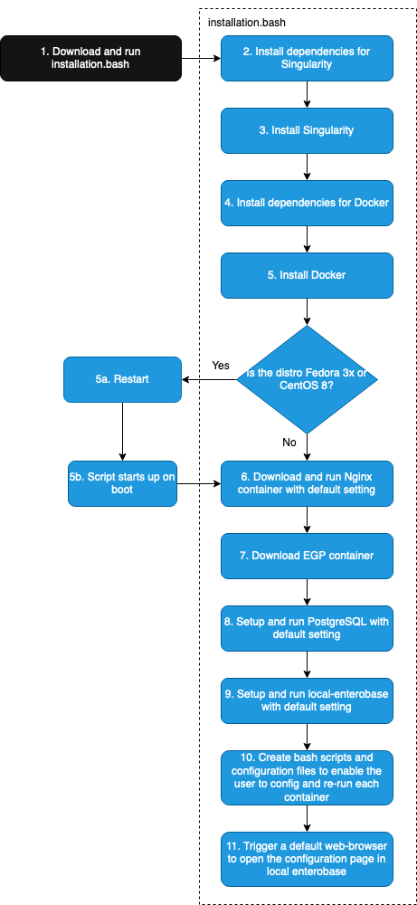

.. _automatic-installation-label:

Automatic Installation
=======================

The automatic installation script can be downloaded using the following command:

``wget https://bitbucket.org/enterobase/local_enterobase/raw/2e0b881c8bbf0f92d22fea55045e8b5f4197a28f/installer/local_enterobase_installer.sh``

The script will automatically download, configure and run the Docker Image (NGINX), and Singularity image (PostgreSQL, Gunicorn and Local EnteroBase) and their dependencies packages.

During the installation the user will be asked to:

- Provide the filepath to the nginx.conf file downloaded when registering on Central EnteroBase
- Set a username and password for Local EnteroBase.

Then system components will be configured using the default parameters and should run without any issue.

Running the Installer
---------------------

The auto installer script can be run using the following command:
::

  sudo ./local_enterobase_installer.sh

Remember, if you created your own certs in section :ref:`nginx-prerequisites-label`, you need to copy them into "$HOME/nginx/certs" and restart the server before continuing.

Generated Scripts
------------------
The auto installer generates a set of scripts to help manage the containers and functions.

* **$HOME/local_enterobase_home/nginx/test_run_nginx.sh:** validate the nginx.conf file
* **$HOME/local_enterobase_home/nginx/run_nginx.sh:** run the nginx docker container
* **$HOME/local_enterobase_home/local_enterobase/restart_local_enterobase.sh:** restart the singularity container and gunicorn
* **$HOME/local_enterobase_home/postgres/run_postgres.sh:** restart the postgres server
* **$HOME/local_enterobase_home/run_all.sh:** run all of the scripts above

Notes
------

* Automatic installation has only been tested on newly created VMs that have not previously installed Singularity, Docker, PostgreSQL or Redis on them. As a result, you may experience issues during installation if your system has previously installed any of the previous softwares. Please contact us if you experience any issues.

* Fedora and CentOS 8 may require a system restart to complete the installation. The script will automatically reboot the server in this event, then restart the script automatically once signed back in. A restart occurs if:

  * Docker is not installed and running for either distribution.
  * Fedora does not have the squashfs dependency already installed.

* The script has been tested on the following distributions: Ubuntu 18.04, Ubuntu 20.04, Fedora 32, Fedora 33, CentOS 7, CentOS 8, Debian 9, and Debian 10.

The following figure shows the script workflow.

