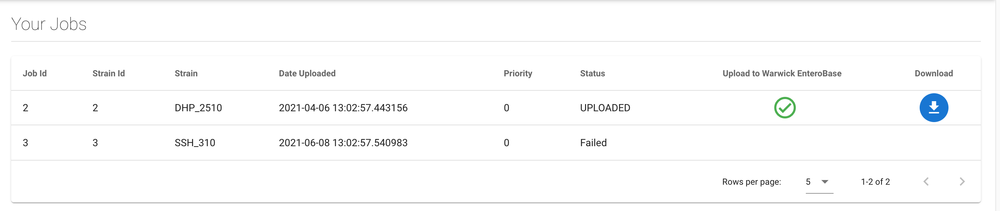

Viewing Jobs
------------

This webpage allows viewing of all jobs that have been produced for the current user, generated from submitted strains and metadata, in a table. Each job is displayed with column headings as identifying metadata, such as the job ID and submission date, and one of the following statuses:

* Received - The job has been queued to be processed.
* Processing - The job is currently being processed.
* Completed - The job has been processed.
* Failed - Processing of the job has failed.

  * **Note:** We intend for the job to be able to be re-generated, although this is currently non-functional in the beta version.

* Uploaded - The job results have been submitted to Central EnteroBase.
* Upload Failed - An attempt to submit the job results to Central EnteroBase has failed, the job can be re-uploaded by the user.

When a job has been successfully processed, 2 blue icons will appear in the table cells under the "Upload to Warwick EnteroBase" and "Download" columns for the job row. These icons can be clicked to upload the results of the job to the Central EnteroBase at Warwick and download the results to local storage respectively.

Note: The page must be refreshed to update the statuses, we intend to implement a live-updating callback in the future.

   **Fig. 1 - Jobs Page**

Uploading
=========

The metadata of the submitted strain and the FASTA and FASTQ result files of the assembly are uploaded to Warwick EnteroBase. The FASTA and FASTQ files stores the reference sequence and sequence reads (and quality scores) respectively. This operation can only be performed once (if successful) to avoid duplicate data being uploaded and subsequently stored. A successful upload is indicated by a green check tick icon in place of the original blue upload icon, which is displayed in figure 1.

Downloading
===========

The metadata of the submitted strain and the FASTA and FASTQ result files of the assembly are downloaded to the default download directory of the web browser. You can redownload the results at any time by clicking the blue download icon, which is displayed in figure 1.
