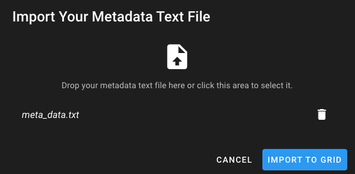

Uploading Strains
----------------------

This webpage, for uploading a strain for the chosen genera, displays an empty, large, grid. Rows can be added to the grid for each strain that you wish to upload, where you must also fill in the required cells corresponding to metadata attributes expressed by the column headings. The individual column headings belong to a primary group in the very first row of the grid.
A grid toolbar is displayed above the grid, which is a row of buttons performing different functions.

.. figure:: ../images/grid_add_rows.png
   :align: center
   :alt: Grid for Salmonella Strain Uploads with 2 Newly Added Rows

   **Grid for Salmonella Strain Uploads with 2 Newly Added Rows**

Adding Rows
============

Clicking the "Add row" button adds an empty row to the grid. You can manually add data by double-clicking each cell in the row.

**Notes**

* If the browser window is shrunk, the "Add Row" button can be located by clicking the blue "Edit" button which will display a drop-down menu of grid functions.
* It is mandatory to add data to the cells highlighted in red, otherwise the data cannot be submitted.
* You cannot have 2 rows with the same strain name as this avoids storing potentially duplicate data.

Adding Read Files
=================

Clicking the cell underneath the "Read Files" column, which is annotated with a "Click to Add" label, displays a pop-up menu where you can select a pair of read files from storage to upload for assembly.

.. figure:: ../images/read_file.png
   :align: center
   :width: 65%
   :alt: Pop-up Menu For Selecting Short-read Files

   **Pop-up Menu For Selecting Short-read Files**

**Notes**

* Read files must be in the format with the file extension ".fastq.gz", otherwise the row will be rejected during submission of the grid.
* You cannot use the same read file twice.
* You cannot use the same read file that is already present in a different row in the grid.

Adding Source Details
=====================

Clicking the "Click to add" cell underneath the "Source Details" column displays a pop-up menu where you can enter the source details for the strain. The source niche and source type are automatically predicted for your input, although you can amend these in the provided dropdown menus. When the source details are correct, clicking the "save" button completes the cell.

   **Visual Guide For Adding Source Details**

Adding Collection Date
======================

Clicking the cell underneath the "Collection Date" column displays a pop-up menu where you can enter the collection date of the strain. The grid accepts dates in the following formats:

* YYYY Format.
* MM/YYYY Format.
* DD/MM/YYYY Format.
* A date selected by clicking the calendar icon in the cell to select a date using the embedded widget.

.. figure:: ../images/add_date_details.png
  :align: center
  :alt: Visual Guide For Adding Date Details

  **Visual Guide For Adding the Collection Date**

Simultaneously Filling Data across Multiple Rows
================================================

To save time performing data entry for columns likely to store the same data across multiple rows, you can select multiple rows and fill all the cells for a certain column at the same time.
You can select the rows that you wish to fill data for in multiple ways:

* Clicking the individual checkbox, located in the column after ID column, for each desired row.
* ctrl+click a cell anywhere in each desired row, which will select the row.
* Select a single "source" row and shift-click a cell in a "destination" row, which selects all rows in between and including the starting and destination rows.

When you have selected the required rows, you can right-click on any cell, belonging to one of the selected rows, underneath the column you want to add data for, a dropdown menu of options will appear where you can delete rows or fill the specific column of selected rows. Clicking the fill option opens an additional dropdown menu where you can input data that you want the cells to be filled with.

Note: Only the following columns are available for multi-filling: "Lab Contact", "Serovar", "Antigenic Formulas" and "Comment".

.. figure:: ../images/fill_multi_rows.png
  :align: center
  :alt: Visual Guide For Filling Multiple Rows

  **Visual Guide For Adding the Collection Date**

Pre-filling Metadata
====================

To save time adding metadata details when submitting your strains, we provide a downloadable template of the grid. This allows you to add any known metadata details ahead of time. When you re-upload the completed template file, it creates and fills the rows according to the file. This reduces the amount of data required to be added to the rows in the webpage, where you can then simply select the short-read files to upload and fill in any remaining cells per row to make the grid submittable.

**Exporting the Template**

Clicking the blue "Export Template" in the grid toolbar downloads the template as a text file (.txt extension) that can be saved appropriately and then opened for editing.

**Notes**

* The grid must be empty of rows to correctly export the template file.
* If the browser window is shrunk, you can export using the "Export Template" button which is located by clicking the blue "Data" button. This displays a drop-down menu of the template importing and exporting functions.

  **Visual Guide For Exporting and Saving the Grid Template (Ubuntu)**

**Filling in the Template**

The template can be opened with text editors that are able to treat the template as a "tab-separated variables" file, where the initial column labels can be divided according to the tabbed whitespace that separates them. The filled template must be saved as a text file (.txt extension), with data separated by tabbed whitespaces, to be successfully imported back into the grid.

**Notes**

* You do not have to fill in every cell as this is intended to save time on the webpage where possible.
* When filling in the template, the initial column labels and their ordering must be preserved to correctly import it back.

.. figure:: ../images/fill_multi_rows.png
  :align: center
  :alt: Visual Guide For Opening and Filling in the Template (Ubuntu)

  **Visual Guide For Opening and Filling in the Template (Ubuntu)**

**Importing the Template**

You can upload the filled template file in 2 ways:

* Clicking the blue "Import Data" function in the grid toolbar, where a popup modal window is displayed. Clicking the cloud icon opens up your file explorer where you can select the template file to upload.
* Dragging the file from your file explorer to the grid, where the popup modal window automatically displays. Dropping the file within the window will select it for upload.

When the file has been uploaded, provided it is in the correct format, a blue "Import to Grid" button appears that will import the data to the grid when clicked, creating rows of the provided strain metadata automatically.

**Notes**

* The grid must be empty of rows to correctly export the template file.
* If there are any issues with the template file format, such as changes in the column order, an import error message will be displayed.
* If the browser window is shrunk, you can import using the "Import from Text File" button which is located by clicking the blue "Data" button. This displays a drop-down menu of the template importing and exporting functions.

  **Modal Window for Uploading a Filled Template File**

.. figure:: ../images/filled_grid.png
  :align: center
  :alt: A Grid With Cells Filled Using an Imported Template File

  **A Grid With Cells Filled Using an Imported Template File**

Submitting the Metadata
=======================

When the grid is complete to your satisfaction, clicking the green "Submit" button uploads your short-read files and metadata, creating and queueing "jobs" to assemble them in the background.
All successfully uploaded rows will disappear from the grid. Any rows that cause issues, such as containing a short-read file that was previously uploaded for assembly, stays in the grid. An appropriate error message is displayed that identifies the failed rows and their reason for failure.
As a result, you can attempt to amend these problems or delete the row from the grid.

**Please do not exit the page or close any notifications whilst the strains are being submitted. Hidden errors may occur and you will also need to resubmit the strain information**

  **Fig. 10 - Displayed Message When All Rows Pass Submission**

.. figure:: ../images/strain_upload_partial_failure.png
  :align: center
  :alt: Displayed Message When a Row Fails Submission

  **Fig. 11 - Displayed Message When a Row Fails Submission**

Tooltips
========

* Shrinking your browser window compresses the grid toolbar:

  * Several functions are moved into a dropdown menu that can be accessed using the blue "edit" button on the left-hand side.
  * The "Import Data" and "Export Template" functions are moved into an additional dropdown menu accessible using the blue "data" button on the right-hand side.

* The cells with the names of the primary column groups can be clicked on to expand showing the entire column group, which by default hides read-only cells that store the results of your inputs to the mandatory cells.
* Single-clicking a cell selects its entire row.
* Double-clicking a cell opens up its respective editor menu for you to input data.
* The blue "Show/Hide Columns" button allows you to show and hide specific individual columns. This is useful if you need to focus on viewing specific features of the data. Note: it is not recommended to hide mandatory columns.
* The blue "Undo" and "Redo" buttons allow the undoing and redoing of your actions in the grid. Warning: They behave temperamentally.
